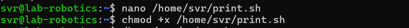
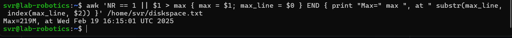

# Linux Management 

### Student
- Sasvi Vidunadi Ranasinghe, sasvi23, amk1005778@student.hamk.fi

## Summary
This notebook describes the activities and tasks related with the microsoft azure, in the course Linux Management of the Degree program ICT and Robotics at Häme University of Applied Sciences. 


### 2025-02-19


## Assignment 5 - Automating Disk Space Monitoring with Cron
## Overview
In this assignment, we created a shell script called print.sh to add a line to the file diskspace.txt, reporting the home directory size and the current date and time. We then used crontab to schedule this script to run every 12 hours, ensuring it runs at least six times to populate diskspace.txt with multiple entries. Finally, we utilized an awk command to find the line with the maximum value in the first column and printed it in the format: Max=[maximum value], at [date and time]. This task helped us automate the process of monitoring disk space and identifying the largest recorded value efficiently.

***Step 1: Create a print.sh script***

- First, used text editor to create the print.sh script.

<br><br/>


- This below script adds a line to the file diskspace.txt, reporting the home directory size and the current date.

```
 #!/bin/bash: Specifies the interpreter to be used.

output=$(du -sh /home | awk '{print $1}'): Gets the home directory size.

current_datetime=$(date): Gets the current date and time.

echo "$output $current_datetime" >> /home/svr/diskspace.txt: Appends the output to diskspace.txt.
```

<br><br/>


***Step 2: Schedule the script using cron***

```
Schedule the script using cron:

crontab -e: Opens the crontab file for editing.

0 */12 * * * /home/your_username/print.sh: Schedules the script to run every 12 hours.

*/3 * * * * /home/your_username/print.sh: (For testing) Schedules the script to run every 3 minutes.
```


- Opened the crontab file.
```
crontab -e
```

- Should add the following line to run the script every 12 hours according to the question:

```
0 */12 * * * /home/svr/print.sh
```

- For testing purposes (run every 3 minutes temporarily):

```
*/3 * * * * /home/svr/print.sh
```

<br><br/>


***Step 3: Fix permissions***

- There were some errors where the script was not executable.
    - So in order to fix the issue, I have given the commands below.

<br><br/>


***Step 4: Run the script a minimum of 6 times***

- After adding the script to cron, it automatically execute every 12 hours, appending a line to diskspace.txteach time. 
- Ensured it runs at least 6 times so that the file accumulates a minimum of 6 lines.

```  
    In this testing case, I had to wait for 18 minutes in order to get the desired 6 outputs, after resetting the entire script.
```


<br><br/>

***Step 5: Locate and print the line containing the maximum size:***

- Execute the following awk command to identify and print the line with the maximum size in the specified format.

```
    This step resulted in the output which I attached down below.
```

<br><br/>
