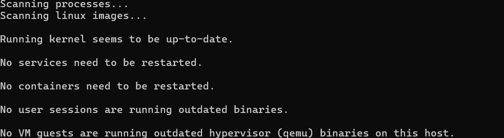

# Linux Management 

### Student
- Sasvi Vidunadi Ranasinghe, sasvi23, amk1005778@student.hamk.fi

## Summary
This notebook describes the activities and tasks related with the microsoft azure, in the course Linux Management of the Degree program ICT and Robotics at Häme University of Applied Sciences. 


## 2025-02-12

### APT & System Updates
#### Part 1

- **Checked my system's APT version and got the result below.**


<br><br/>


- **Updated the package list and this was the output I recieved.**


<br><br/>

- **Then I upgraded the installed packages and this was the end of the processing I recieved.**


<br><br/>


**What is the difference between update and upgrade?**
```
Difference Between Update and Upgrade:

sudo apt update: This command refreshes the list of available packages and their versions. It does not install or upgrade any packages. Essentially, it updates the local package database with the latest information on available packages and their versions from the repositories.

sudo apt upgrade: This command installs the newest versions of all currently installed packages that have updates available. It upgrades the installed packages to the latest versions based on the updated package list obtained from apt update.

```

- **And I checked whether there's any pending updates.**

<br><br/>

- There wasn't any pending updates.

### Installing & Managing Packages
#### Part 2

- **Searched for a package, in this case an image editor, using APT.**
    - This is a part of the list that I have gotten.

<br><br/>

- I have selected **fim** as my editor to proceed.

- **Viewed package details:**

    - Get detailed information about the selected package, which in my case *fim*.

<br><br/>

- **Installed the fim package:**
    - This screeshot provides the last part of the processing.

<br><br/>


- **Checked installed package version**

    - **What version was installed?**

    ```
    The installed package version is 0.6~rc2-1build2.
    ```

<br><br/>


### Removing & Cleaning Packages
#### Part 3

- **Uninstalled the package fim:**

    - **Is the package fully removed?**

    ```
    No, the package itself is removed, but its configuration files remain on the system.
    ```

<br><br/>

- **Removed configuration files of fim:**
    - **What is the difference between remove and purge?**

    ```
    sudo apt remove: This command removes the package, but leaves behind configuration files.

    sudo apt purge: This command removes both the package and its configuration files, resulting in a cleaner removal.
    ```

<br><br/>

- **Cleared unnecessary package dependencies:**
    - I have taken the screenshot of the first part of the process. 

         - **Why is this step important?**

         ```
         This step removes packages that were automatically installed to satisfy dependencies for other packages and are no longer needed. This helps free up disk space and keeps my system clean.
        ```
<br><br/>


- **Cleaned Up Downloaded Package Files:**

    - **What does this command do?**

        ```
        It removes the local repository of retrieved package files, freeing up disk space.
        ```


<br><br/>


### Managing Repositories & Troubleshooting
#### Part 4

- **Listed all APT repositories:**

    - **What do you notice in this file?**

    ```
    In this file, I founnd URLs for the repositories used by APT to download packages and updates. 
    Additionally, there are comments indicating that some Ubuntu sources have moved to a different file format called deb822.
    These sources can now be found in the /etc/apt/sources.list.d/ directory. 
    This new format helps in managing package sources more efficiently.
    ```

<br><br/>

- **Added a new repository (example: universe repository):**

    - **What types of packages are found in the universe repository?**
    ```
    The Universe repository contains community-maintained free and open-source software packages. These packages are not officially supported by Canonical but are maintained and updated by the community. They often include a wide variety of applications, tools, and libraries that are widely used and valued by users.
    ```

<br><br/>

- **Simulated an installation failure and troubleshoot:**

    - **What error message do you get?**

    ```
    E: Unable to locate package fakepackage error message appeared.
    ```

    - **How would you troubleshoot this issue?**

    ```
    Check Package Availability: Verify if the package exists in the repositories by searching for it using:
    ```
    <br><br/>

    ```
    This confirms that the package does not exist in the repositories.
    ```

### Bonus Challenge

- **Why would you want to hold a package?**

   
    Holding a package prevents it from being automatically updated by apt upgrade. This can be useful in scenarios such as:

    Compatibility: Ensuring the package remains compatible with certain dependencies or software that may break with newer versions.

    Stability: Retaining a known stable version of a package that works well in your environment, especially in production systems.

    Custom Modifications: Preventing custom modifications or configurations from being overwritten by newer updates.

    Holding a package provides control over updates and maintains system stability and compatibility.
    