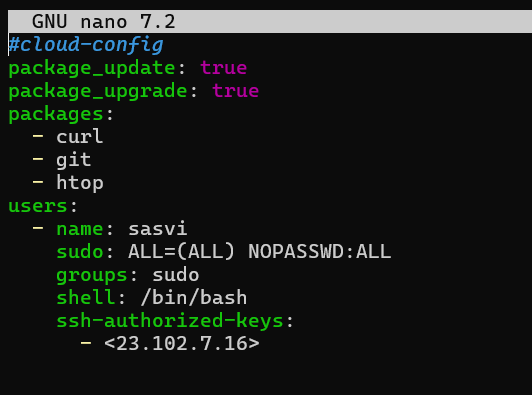

# Linux Management 

### Student
- Sasvi Vidunadi Ranasinghe, sasvi23, amk1005778@student.hamk.fi

## Summary
This notebook describes the activities and tasks related with the microsoft azure, in the course Linux Management of the Degree program ICT and Robotics at Häme University of Applied Sciences. 

## Linux Virtualization Exercise

### Part 1: Introduction to virtualization concepts

# Virtualization Concepts

## Part 1: Introduction to Virtualization Concepts

### Key Concepts Overview

#### Virtualization
Virtualization is a process that creates an abstraction layer over computer hardware. It allows a single physical machine to run multiple virtual systems, maximizing resource utilization. This is achieved through specialized software called a **hypervisor**.

#### Hypervisor
A hypervisor (or Virtual Machine Monitor) is software that manages the creation and operation of virtual machines (VMs). There are two types of hypervisors:
- **Type 1 (Bare Metal)**: Runs directly on hardware, e.g., VMware ESXi, Xen.
- **Type 2 (Hosted)**: Runs on top of an existing operating system, e.g., VirtualBox, VMware Workstation.

#### Virtual Machines (VMs)
A virtual machine (VM) is a fully virtualized computing environment. It includes:
- Its own operating system (guest OS)
- Virtual hardware, including CPU, RAM, storage, and network interfaces
- Complete isolation from other VMs
VMs rely on hypervisors to allocate physical resources and ensure isolation.

#### Containers
Containers are lightweight environments that package an application, along with its dependencies and runtime libraries. Unlike VMs, containers share the host operating system (OS) kernel. Key characteristics include:
- **Efficient resource utilization**: Uses minimal overhead since they avoid the need for a full guest OS.
- **Faster startup**: Containers can be launched in seconds.
- **Portability**: Applications in containers can run on multiple environments without modification.

### VMs vs. Containers: A Comparison

| **Aspect**          | **Virtual Machines (VMs)**                                  | **Containers**                                       |
|----------------------|-----------------------------------------------------------|----------------------------------------------------|
| **Architecture**    | Each VM has its own guest OS and virtual hardware.          | Containers share the host OS kernel.              |
| **Resource Utilization** | Higher overhead due to running complete OS instances.         | Lower overhead, utilizing host OS resources.       |
| **Isolation Level** | Full hardware-level isolation; highly secure.              | Process-level isolation; lighter and more flexible.|

### Summary
- **VMs** provide complete isolation, making them suitable for scenarios requiring strict security.
- **Containers** are resource-efficient and ideal for microservice architectures and DevOps workflows. Their agility makes them increasingly popular in cloud-native development.


## Part 2: Working with multipass

### Installation

```
> Install Multipass
    sudo snap install multipass
```
<br><br/>

### Basic commands

```
> Launch the default Ubuntu instance
    multipass launch --name myvm
```
<br><br/>


```
> List of all running instances
    multipass list
```
<br><br/>


```
> Check instance details
    multipass info myvm
```
<br><br/>


```
> Access the shell of the instance
    multipass shell myvm
```
<br><br/>

```
> Run a command in the instance
    multipass exec myvm -- uname -a
```
<br><br/>

```
> Stop the running instance
    multipass stop myvm
```
<br><br/>

```
> Delete the instance
    multipass delete myvm
```
<br><br/>

### Create the Cloud-init Config File

```
> create a new file
    nano cloud-init.yaml
```
<br><br/>

- This *updates* the VM, installs **curl**, **git**, and **htop**.
- It also *creates* a **sasvi** user with sudo access.


```
> Launch Multipass with Cloud-init
    multipass launch --name myvm-cloud --cloud-init cloud-init.yaml

> check if the user exists
    multipass exec myvm-cloud -- grep "sasvi" /etc/passwd

> check if the packages installed
    multipass exec myvm-cloud -- which git htop curl

```
<br><br/>

### File sharing & Policy

```
> Create a Shared Folder
    mkdir ~/multipass-share

> Mount the Folder in the Multipass Instance
    multipass mount ~/multipass-share myvm-cloud:/home/ubuntu/shared-folder

> Verify the Shared Folder in the Multipass Instance
    multipass shell myvm-cloud

```
<br><br/>

```
> Check If the Folder Exists in Multipass
    ls -l /home/ubuntu/
```
<br><br/>

```
> Create a Test File in the Shared Folder
    echo "Hello from Multipass" > /home/ubuntu/shared-folder/testfile.txt

> check if the file was created
    ls -l /home/ubuntu/shared-folder/
```
<br><br/>

```
> Verify that the file is accessible from the host machine
    ls -l ~/multipass-share/

> check the shared folder
    ls -l /home/ubuntu/

```
<br><br/>


## Part 3: Exploring LXD

```
> Initialize LXD
    sudo lxd init

> Check LXD version
    lxd --version

> List available LXC images
    lxc image list images:

```

```
> Launch a container
    lxc launch images:ubuntu/noble/desktop mylxdcontainer --vm

> Check container is running or not
    lxc list
```
<br><br/>

```
> Check running containers
    lxc list
    (The lxc command is not available inside the container because LXD is installed on the host, not inside the container.)

> Check system information
    uname -a
    (This displays the kernel version and system details of the container.)

> List files in the root directory
    ls -l /
    (This shows the files and directories inside the container's root filesystem.)
```

<br><br/>

## Part 4: How to Stick Apps with Docker

### Install Docker

```
> install Docker on my system
    sudo apt update && sudo apt install -y docker.io

>  Start and enable Docker
    sudo systemctl start docker
    sudo systemctl enable docker
```

### Basic Docker commands

```
> Check running containers
    docker ps

> Run a simple container (hello-world)
    docker run hello-world
```
<br><br/>

## Part 5: Snaps for Self-Contained Applications

```
>  install Snapcraft
    sudo snap install snapcraft --classic

> check whether it's working
    snapcraft --version
```

### Initialize a Snap Project

```
> Create a directory for the Snap package
    mkdir my-snap-app && cd my-snap-app

> Initialize the project
    snapcraft init

> Open snap/snapcraft.yaml in a text editor
    nano snap/snapcraft.yaml

> paste content into snapcraft.yaml


> create a simple script inside a bin folder
    mkdir -p bin
    echo -e '#!/bin/bash\necho "Hello, Snap!"' > bin/hello.sh
    chmod +x bin/hello.sh


> Edit snapcraft.yaml

name: my-snap-app
base: core24
version: '0.1'
summary: A simple Snap example
description: |
  This Snap contains a simple script that prints "Hello, Snap!"

grade: devel
confinement: devmode

apps:
  hello:
    command: bin/hello.sh  # This is the script you created

parts:
  my-part:
    plugin: dump
    source: .  # Tells Snapcraft to include everything in the current directory
    organize:
      bin/hello.sh: bin/hello.sh

> Build the Snap
    snapcraft

> Run the snap
    snap run my-snap-app.hello
```


<br><br/>


