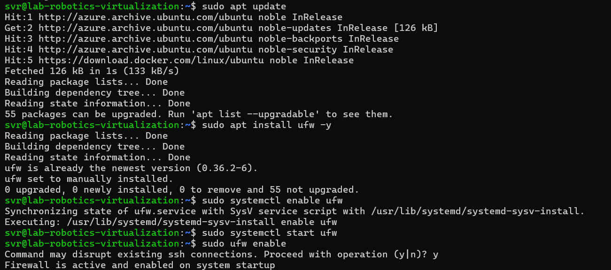
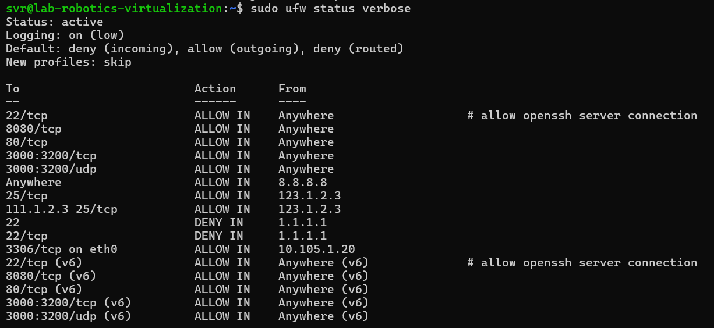
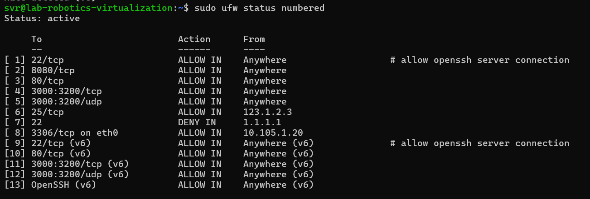
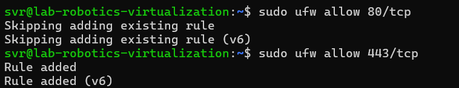
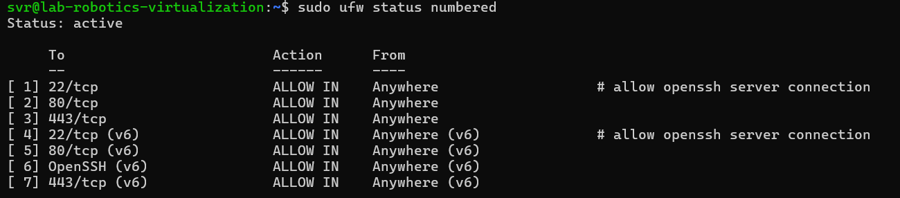
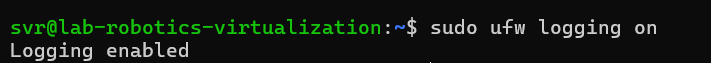
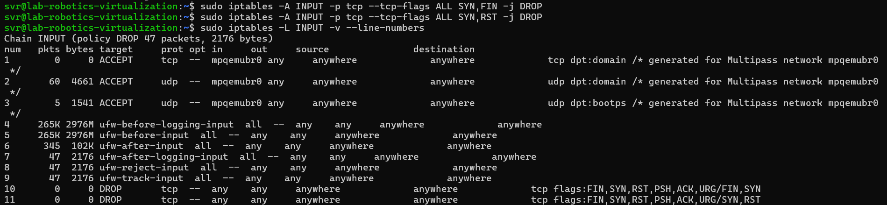
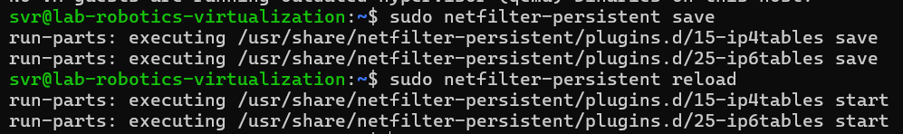

# Linux Management 

### Student
- Sasvi Vidunadi Ranasinghe, sasvi23, amk1005778@student.hamk.fi

## Summary
This notebook describes the activities and tasks related with the microsoft azure, in the course Linux Management of the Degree program ICT and Robotics at Häme University of Applied Sciences. 


## Firewall Configuration Process

This report documents the steps taken to configure a firewall on the server. The firewall ensures secure access to essential services while blocking unauthorized connections. The configuration includes logging, SYN flood prevention, and an additional rule based on security research.


### Step 1: Install and Enable UFW

```
> Install UFW
    sudo apt update
    sudo apt install ufw -y

> Enable UFW
    sudo systemctl enable ufw
    sudo systemctl start ufw
```

<br><br/>

### Step 2: Check Firewall Status

```
> Verify that UFW is running
    sudo ufw status verbose
```
<br><br/>


### Step 3: Allow OpenSSH (SSH Access)

```
> To prevent getting locked out when using SSH
    sudo ufw allow OpenSSH

> list the current firewall rules 
    sudo ufw status numbered

> clean up unnecessary rules
    sudo ufw delete 6   
    sudo ufw delete 7  
    sudo ufw delete 8   
    sudo ufw delete 9   
    sudo ufw delete 10
```

- Duplicate SSH Rules → No major issues, but unnecessary.
- Allowing 8.8.8.8 (Rule 6) → Likely unnecessary, might cause unintended access.
- SMTP Rules (Rules 7 & 8) → If you’re not running a mail server, they should be removed.
- Blocked SSH for 1.1.1.1 (Rules 9 & 10) → If that’s not intentional, it could block access later.

<br><br/>

### Step 4: Allow HTTP and HTTPS Traffic

```
> Allow HTTP traffic
    sudo ufw allow 80/tcp 

> Allow HTTPS traffic
    sudo ufw allow 443/tcp

```

<br><br/>

### Step 5: Clean Up Unnecessary Rules

```
> Remove port 8080 (not required)
    sudo ufw delete 2

> Remove port range 3000:3200 (not required)
    sudo ufw delete 4
    sudo ufw delete 5

> Remove mail server rule (port 25) (not required)
    sudo ufw delete 6

> Remove MySQL remote access rule (port 3306) (not required, security risk)
    sudo ufw delete 8

>  Remove port range 3000:3200 (IPv6) (not required)
    sudo ufw delete 12
    sudo ufw delete 13

> allow HTTPS
    sudo ufw allow 443/tcp
```
<br><br/>

### Step 6: Enable Logging for Firewall

```
> To log blocked and allowed connections, enable UFW logging
    sudo ufw logging on
```

<br><br/>

### Step 7: Prevent SYN Flood Attacks

- SYN flood attacks try to overwhelm a server by sending many half-open TCP connections.
- To help mitigate this:

```
    sudo ufw limit proto tcp from any to any port 22
```
🔹 This limits SSH login attempts to prevent brute force attacks.

- Additionally, we can tweak kernel settings to protect against SYN floods.

```
    sudo nano /etc/sysctl.conf

> Adding these below lines
    net.ipv4.tcp_syncookies = 1
    net.ipv4.tcp_max_syn_backlog = 2048
    net.ipv4.conf.all.rp_filter = 1

> Save and apply changes
    sudo sysctl -p

```

### Step 8: Prevent Stealth Port Scans

```
> Since ufw does not support TCP flag filtering, we use iptables to block packets with unusual flag combinations used in stealth scans:
    sudo iptables -A INPUT -p tcp --tcp-flags ALL SYN,FIN -j DROP
    sudo iptables -A INPUT -p tcp --tcp-flags ALL SYN,RST -j DROP

```
<br><br/>

### Step 9: Save the iptables Rules for Persistence

```
> Since iptables rules do not persist after a reboot, save them using:
    sudo apt install iptables-persistent -y  
    sudo netfilter-persistent save
    sudo netfilter-persistent reload

```

<br><br/>

### Step 10: Verify Logging

```
> Check the UFW logs to ensure it's capturing blocked and allowed traffic:
    sudo cat /var/log/ufw.log | less
```


